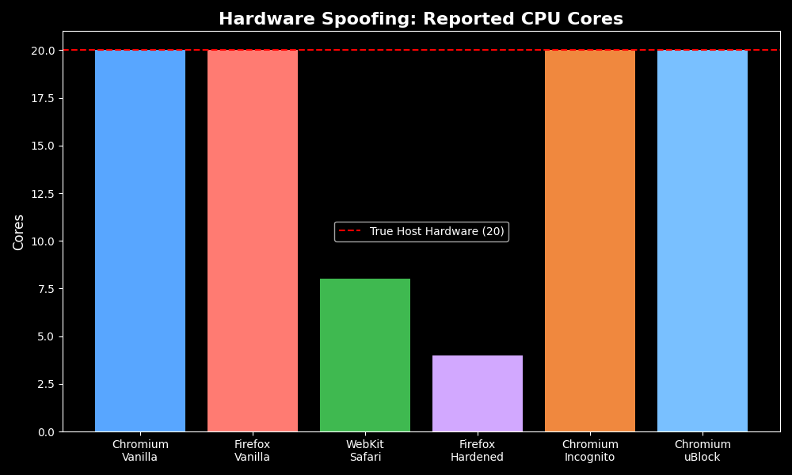
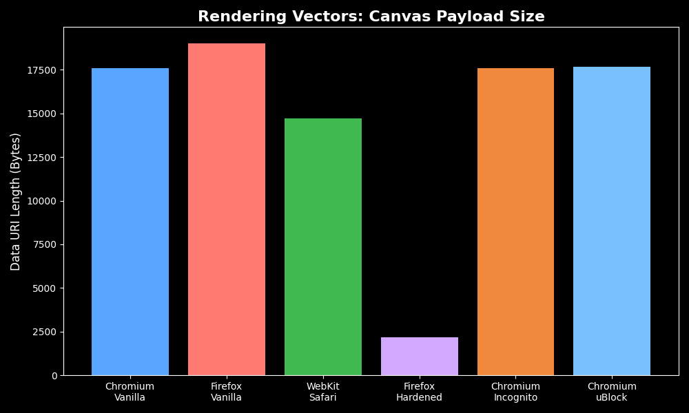
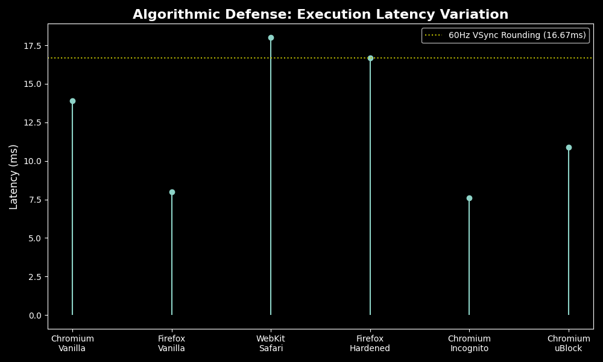

# 🕵️‍♂️ FP-Auditor: Browser Fingerprinting Defense Matrix


An automated honeypot and auditing matrix designed to empirically measure how modern browser engines (Chromium, WebKit, Gecko) defend against stateless fingerprinting tracking techniques.

## 🚀 Overview
Modern web tracking has evolved beyond cookies into stateless "fingerprinting"—extracting device-specific hardware and rendering quirks to uniquely identify users. Existing browser defenses rely on either **Content Blocking** (which breaks on unknown domains) or **API Restriction** (which breaks legitimate site functionality).

**FP-Auditor** acts as a local telemetry honeypot. It deploys known fingerprinting heuristics (Canvas, AudioContext, CPU profiling) and uses headless browser automation to stress-test how different browser profiles react to data extraction attempts.

## 🧰 Architecture & Probes

The suite orchestrates a multi-language pipeline to extract and visualize browser telemetry:

* **The Orchestrator (`src/core/audit.js`):** A Node.js Playwright matrix that systematically launches 6 distinct browser profiles (Vanilla Chromium, WebKit/Safari, Hardened Firefox, Incognito, and uBlock-enabled profiles).
* **The Honeypot (`src/probes/`):** A modular JavaScript environment executing state-of-the-art tracking vectors:
  * **Rendering Vectors:** `canvas.js` and `audio.js` extract mathematical rendering variances.
  * **Hardware Probing:** `hardware.js` queries `navigator.hardwareConcurrency` and memory APIs.
  * **Algorithmic Timing:** `timing.js` uses the `Performance` API to measure execution latency for CPU tiering.
* **The Visualizer (`visualize.py`):** A Matplotlib pipeline that translates the extracted JSON payload matrix into comparative visualizations.

---

## 📊 Empirical Findings

Our automated audits reveal the exact mechanisms—and failures—of modern browser defenses:

### 1. Hardware Spoofing (Functionality Probing)
Standard browsers leak the host machine's exact CPU core count. Privacy-focused engines actively spoof this data to blend the user into a generic hardware pool (e.g., Safari capping at 8 cores, Hardened Firefox capping at 4 cores).


### 2. Content Blocking Failures (Rendering Vectors)
Standard ad-blockers (like uBlock Origin) rely on domain blacklists. Because our honeypot runs on `localhost` (an unknown domain), content blocking completely fails to stop Canvas API extraction. Only strict API Restriction (Firefox Hardened) successfully intercepts the payload.


### 3. Algorithmic Defense (Execution Latency)
To defeat CPU-timing attacks, Hardened Firefox artificially rounds the JavaScript performance clock to 16.67ms (matching 60Hz VSync). This successfully destroys the fingerprinting vector but breaks legitimate performance debugging for web developers.


---

## ⚙️ Installation & Usage

### Prerequisites
* Node.js (v18+)
* Python 3.10+ (with `matplotlib`)

### 1. Setup the Environment
```bash
git clone [https://github.com/yourusername/fp-auditor.git](https://github.com/yourusername/fp-auditor.git)
cd fp-auditor
npm install playwright
npx playwright install webkit
```

### 2. Launch the Honeypot
Start the local server to host the fingerprinting probes:
```bash
python3 -m http.server 8000
```

### 3. Execute the Automated Audit Matrix
In a separate terminal, run the Playwright orchestrator to gather the telemetry:
```bash
node src/core/audit.js
```
*(This will generate a `results_matrix.json` file in the root directory).*

### 4. Generate Visualizations
Parse the JSON payload and generate the comparative PNG plots:
```bash
python3 visualize.py
```

## 📝 Disclaimer
This tool was developed for academic security research purposes. It is designed to evaluate browser defense mechanisms locally and should not be deployed on public-facing servers to track users.
